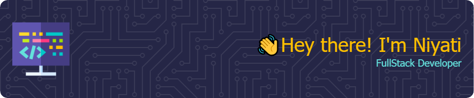

## 👨‍💻 About Me

Passionate about leveraging technology to build innovative solutions, I specialize in scalable web development with a focus on creating seamless user experiences. With a solid foundation in front-end development and certification in full-stack development, coupled with AWS expertise, I'm committed to pushing the boundaries of what's possible in the digital realm.

## 🌟 What Sets Me Apart

- **Continuous Learner:** Always seeking opportunities to expand my skill set and stay updated with the latest technologies and trends.
- **Collaborative Spirit:** Thrives in team environments, valuing diverse perspectives and fostering open communication to drive collective success.
- **Problem Solver:** Navigates dynamic environments with a positive mindset, leveraging creativity and critical thinking to find solutions.
- **Effective Communicator:** Excels in both written and verbal communication, fostering positive relationships with team members and stakeholders.

## 📫 Let's Connect

Open to collaborating on exciting projects and exploring new opportunities. Reach out via [email](mailto:patel_niyati@outlook.com) or connect on [LinkedIn](https://www.linkedin.com/in/niyati-mukesh-patel/).

### 💼 Skills

#### 📋 Languages

#### 📚 Frameworks, Platforms and Libraries

More Skills

#### 💾 Databases

#### ☁️ Hosting/SaaS

#### 💻 IDEs/Editors

#### 🎨 Design

#### 🕓 Version Control

#### 🧑‍💻 Developer/Forums

#### 🎓 Education

#### 🥅 Other

